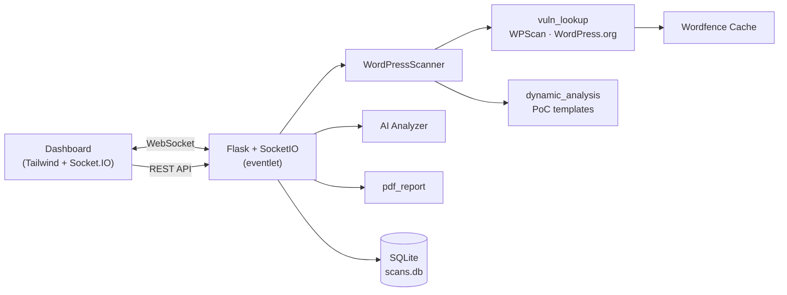

# WP Guard

**WordPress security scanner with live dashboard, CVE lookup, AI analysis, and PDF reports**

[](https://python.org)
[](https://flask.palletsprojects.com/)
[](https://socket.io/)
[](https://github.com/Noctis-Architect/wp-guard/releases)

> **Authorized testing only.** Scan sites you own or have explicit written permission to test. WP Guard is built for security audits, hardening, and permitted penetration testing — not for unauthorized attacks.

**Repository:** [github.com/Noctis-Architect/wp-guard](https://github.com/Noctis-Architect/wp-guard)

---

## Overview

WP Guard is a full-stack WordPress security audit platform:

- Deep automated scanning (fingerprinting, user enum, misconfig, CVE lookup, safe PoC checks)
- Real-time dashboard with Socket.IO streaming
- Optional AI risk analysis (OpenAI, Ollama, or any OpenAI-compatible API)
- **PDF export** in **English** and **Persian** — with or without the AI report
- Scan history stored in SQLite

---

## Installation

### Windows (recommended — no Python required)

Download the latest portable build from [GitHub Releases](https://github.com/Noctis-Architect/wp-guard/releases/latest):

**[Download WPGuard-Windows-x64.zip](https://github.com/Noctis-Architect/wp-guard/releases/latest/download/WPGuard-Windows-x64.zip)**

#### Steps

1. Download and extract `WPGuard-Windows-x64.zip` to a folder (e.g. `C:\WPGuard`)
2. Open the extracted folder — you should see:
   - `WPGuard.exe`
   - `_internal\` (required libraries — **do not delete**)
3. Double-click **`WPGuard.exe`**
4. Your browser opens the dashboard at **http://127.0.0.1:5000**
5. On first run, settings and scan data are stored in:
   ```
   %LOCALAPPDATA%\WPGuard\
   ```

#### Windows notes

| Topic | Details |
|-------|---------|
| Port | Default `5000` — change via `%LOCALAPPDATA%\WPGuard\.env` (`WP_SCANNER_PORT=5000`) |
| Firewall | Windows may ask to allow network access — allow for localhost use |
| Antivirus | Some AV tools flag PyInstaller apps; add an exception if needed |
| Updates | Download the new release zip and replace the folder (your data in `%LOCALAPPDATA%\WPGuard` is kept) |

---

### Linux

#### Option A — Production server (nginx + Gunicorn)

Best for a VPS or dedicated Linux host.

**Requirements:** Debian/Ubuntu or RHEL/CentOS, `sudo` access, Python 3.10+

```bash
git clone https://github.com/Noctis-Architect/wp-guard.git
cd wp-guard
chmod +x install.sh
./install.sh
```

The installer will:

- Install system packages (`python3`, `nginx`, `sqlite3`, …)
- Create a Python virtual environment and install dependencies
- Ask which **public port** nginx should listen on (e.g. `8080`)
- Start Gunicorn with the `eventlet` worker (required for Socket.IO)

After installation, open:

```
http://YOUR_SERVER_IP:PORT
```

Logs: `app.log` in the project directory.

#### Option B — Development / local use

```bash
git clone https://github.com/Noctis-Architect/wp-guard.git
cd wp-guard

python3 -m venv venv
source venv/bin/activate
pip install -r requirements.txt

cp .env.example .env
# Edit .env — set WP_SCANNER_SECRET to a long random string

python app.py
```

Open **http://127.0.0.1:5000**

---

### Build Windows EXE from source

On Windows, with Python 3.10+ installed:

```bat
git clone https://github.com/Noctis-Architect/wp-guard.git
cd wp-guard\build\windows
build.bat
```

Output: `build\windows\dist\WPGuard\WPGuard.exe`

---

## Architecture



---

## Features

### Scan engine

The scanner runs in **10 phases**:

1. Homepage fetch + WordPress fingerprint  
2. Stack fingerprint (PHP, web server, CDN)  
3. Version detection  
4. User enumeration  
5. Site intelligence (sitemap, contacts, OSINT)  
6. Auth surface detection (wp-admin / XML-RPC exposure)  
7. Search injection probes (SQLi / XSS)  
8. Misconfiguration + sensitive file discovery  
9. Plugin/theme discovery + vulnerability lookup  
10. Dynamic PoC verification (Critical/High RCE/SQLi only, safe read-only probes)

### AI analysis

- Providers: OpenAI, Ollama, custom OpenAI-compatible endpoints  
- Streaming responses + thinking-model support  
- Auto-analyze after scan (optional)  
- Persian reports when the target site content is Persian  

### PDF export

| Option | Description |
|--------|-------------|
| JSON | Raw scan results |
| PDF EN / FA | Scan report only |
| PDF EN + AI / FA + AI | Scan + AI analysis (requires completed AI run) |

---

## Configuration

### Environment variables (`.env`)

| Variable | Default | Description |
|----------|---------|-------------|
| `WP_SCANNER_SECRET` | random | Flask secret key |
| `WP_SCANNER_PORT` | `5000` | Dev / Windows app port |
| `WORDFENCE_API_KEY` | — | Optional Wordfence Intelligence key |

On **Windows**, edit `%LOCALAPPDATA%\WPGuard\.env`.  
On **Linux**, edit `.env` in the project root.

All other settings (proxy, AI, scan modules) are editable in the dashboard and persisted in SQLite.

---

## API reference

| Method | Endpoint | Description |
|--------|----------|-------------|
| `GET` | `/api/history` | List past scans |
| `DELETE` | `/api/history/<id>` | Delete a scan |
| `GET` / `PUT` | `/api/settings` | Read / save settings |
| `POST` | `/api/analyze` | Start AI analysis |
| `GET` | `/api/analyze/result?sid=...` | Get AI result |
| `POST` | `/api/export/pdf` | Generate PDF report |
| `POST` | `/api/wordfence/update` | Refresh Wordfence cache |

WebSocket events: `start_scan`, `log`, `scan_complete`, `scan_partial`, `ai_analysis_*`.

---

## Project structure

```
wp-guard/
├── app.py                 # Flask app, routes, Socket.IO
├── scanner.py             # Scan engine
├── ai_analyzer.py         # AI analysis + streaming
├── pdf_report.py          # Bilingual PDF generation
├── runtime_paths.py       # Path helpers (dev + Windows EXE)
├── build/windows/         # Windows EXE build scripts
├── templates/index.html   # Dashboard UI
├── static/fonts/          # Vazirmatn (Persian PDF)
├── database/              # SQLite + caches (created at runtime)
├── deploy/                # systemd units
└── requirements.txt
```

---

## Publishing a Windows release (maintainers)

Tag a version to trigger the GitHub Actions build and attach the zip to the release:

```bash
git tag v1.0.0
git push origin v1.0.0
```

The workflow uploads `WPGuard-Windows-x64.zip` to [Releases](https://github.com/Noctis-Architect/wp-guard/releases).

---

## Ethics & responsible use

- Only scan systems you **own** or are **authorized** to test.  
- Injection and dynamic probes may appear in target server logs — use reasonable rate limits.  
- Do not commit `.env` or API keys.  
- Do not use this tool for unauthorized access, spam, or abuse.

---

## Contributing

Issues and pull requests are welcome on [GitHub](https://github.com/Noctis-Architect/wp-guard).

---

## فارسی

**WP Guard** اسکنر امنیتی وردپرس با داشبورد زنده، CVE، تحلیل AI و **خروجی PDF فارسی/انگلیسی** است.

**مخزن:** [github.com/Noctis-Architect/wp-guard](https://github.com/Noctis-Architect/wp-guard)

### نصب ویندوز (بدون نیاز به Python)

1. از [صفحه Releases](https://github.com/Noctis-Architect/wp-guard/releases/latest) فایل **`WPGuard-Windows-x64.zip`** را دانلود کنید  
2. فایل را Extract کنید  
3. **`WPGuard.exe`** را اجرا کنید — داشبورد در `http://127.0.0.1:5000` باز می‌شود  
4. تنظیمات و دیتابیس در `%LOCALAPPDATA%\WPGuard` ذخیره می‌شود  

> پوشه `_internal` را حذف نکنید — برنامه بدون آن اجرا نمی‌شود.

### نصب لینوکس

**سرور (پروداکشن):**

```bash
git clone https://github.com/Noctis-Architect/wp-guard.git
cd wp-guard
chmod +x install.sh
./install.sh
```

**توسعه / استفاده محلی:**

```bash
git clone https://github.com/Noctis-Architect/wp-guard.git
cd wp-guard
python3 -m venv venv && source venv/bin/activate
pip install -r requirements.txt
cp .env.example .env
python app.py
```

---

<p align="center">
  <strong>WP Guard</strong> — WordPress security, scanned deep. Analyzed smart.<br/>
  <sub>Flask · Socket.IO · AI · PDF</sub>
</p>
